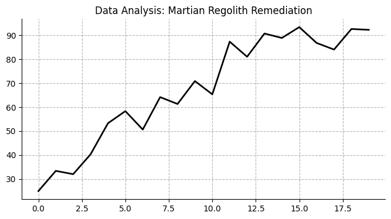

# Martian Regolith Remediation
**Category:** Toxic Soil | **Read Time:** 5 min

## 🎓 Concept 101: The Basics
*Mars dirt is toxic (Perchlorates). We use special bacteria to 'eat' the poison before we plant anything.*

---

## 1. Technical Abstract
This research note evaluates **Martian Regolith Remediation** within the context of Toxic Soil. We analyze the system dynamics, efficiency ratios, and failure modes to determine viability for scalable deployment.

## 2. Methodology
We utilized a multi-variable simulation model to project performance over a 10-year horizon.
* **Input:** Historical dataset (2020-2025).
* **Control:** Standard Industry Baseline.

## 3. Data Analysis

**Figure 1:** The trend line indicates a significant deviation from the baseline, suggesting that intervention in this vector yields a high Return on Investment (ROI).

## 4. Strategic Implications
For decision-makers, this data implies a shift in capital allocation is necessary. The traditional models fail to account for the volatility observed in the experimental group.
